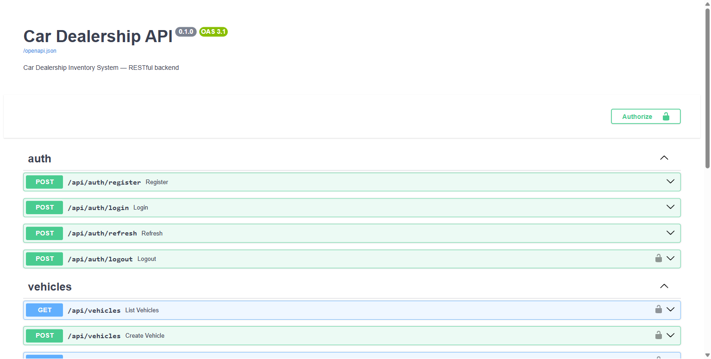
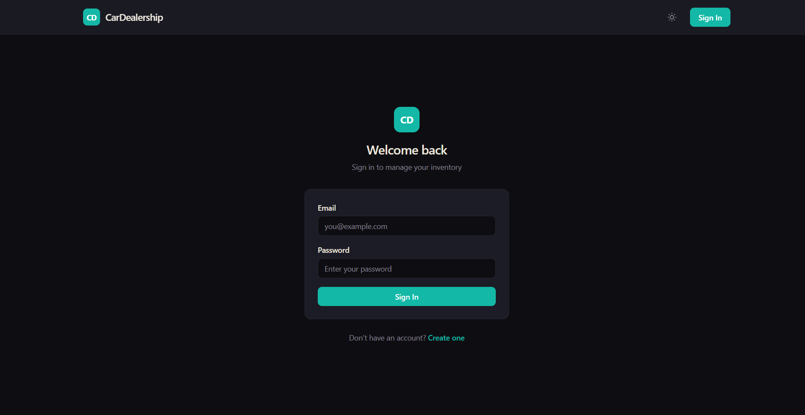
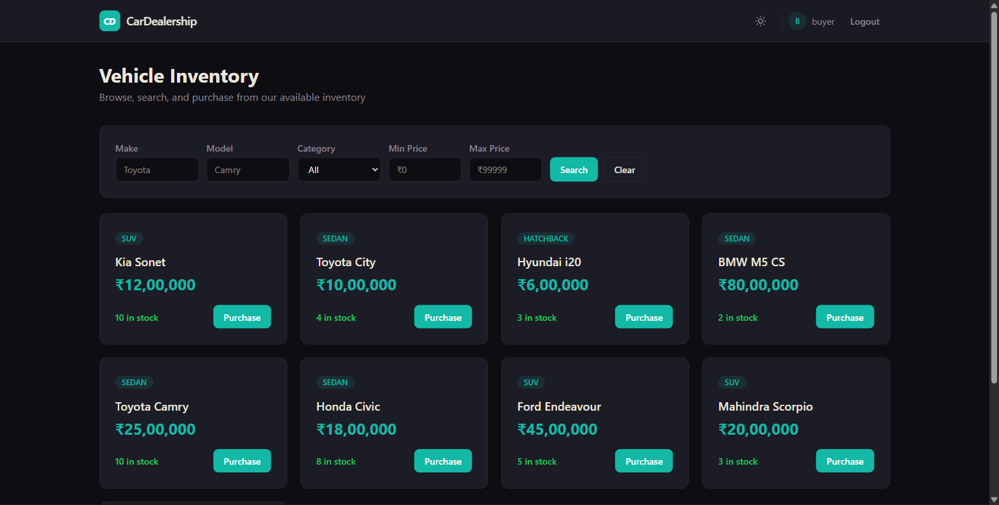
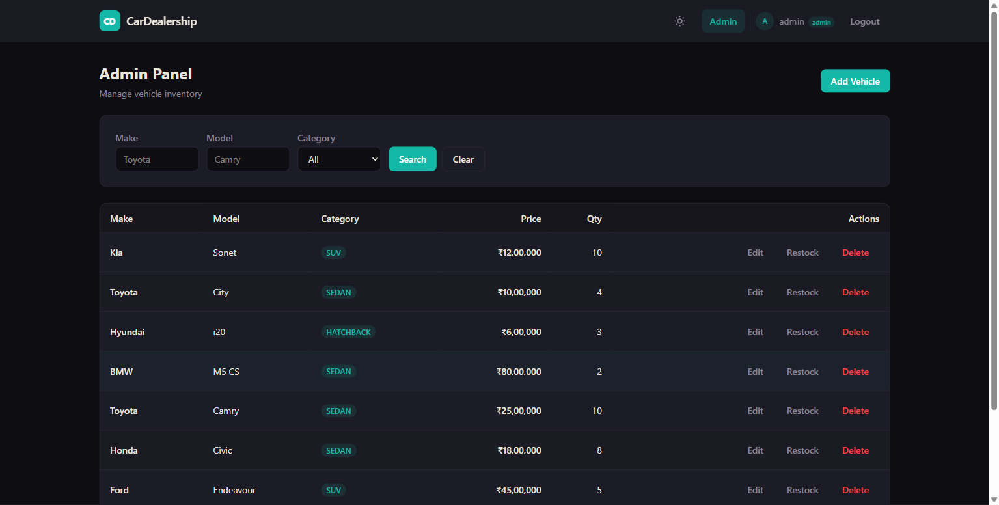

# Car Dealership Inventory System

A full-stack Car Dealership Inventory System built with FastAPI and React. Features JWT authentication with refresh token rotation, vehicle inventory management with atomic purchase operations, admin panel, and comprehensive test coverage following TDD practices.

## Tech Stack

| Layer | Technology |
|---|---|
| **Backend** | Python 3.11+, FastAPI, SQLAlchemy 2.0, PostgreSQL |
| **Frontend** | Vite 8, React 19, TypeScript, Tailwind CSS v4 |
| **Auth** | Argon2id (OWASP #1), JWT access + opaque refresh tokens |
| **Testing** | pytest, httpx, pytest-cov (44 tests, 97% coverage) |

## Features

- **User Authentication** — Register, login, token refresh with rotation and reuse detection, logout
- **Vehicle Management** — Add, list, search (by make, model, category, price range), update, delete
- **Inventory Operations** — Purchase (atomic, prevents overselling), restock
- **Role-Based Access** — Admin-only operations (create, update, delete, restock)
- **Frontend** — Dashboard with vehicle cards and search/filter, admin panel with table and CRUD modals, light/dark theme toggle
- **Security** — Argon2id password hashing, in-memory access tokens, httpOnly refresh cookies with rotation, CSRF protection, rate limiting, CSP headers, CORS with regex origin matching

## Security Architecture

- **Password storage:** Argon2id (memory cost 64 MB, time cost 3, parallelism 4) — OWASP #1 recommendation
- **Access tokens:** JWT, 15-minute expiry, stored in React state (never persisted to disk)
- **Refresh tokens:** Opaque 32-byte random strings, SHA-256 hashed in database, stored in httpOnly Secure SameSite=Lax cookies, rotated on every use with family-based reuse detection
- **CSRF:** Refresh endpoint requires `X-CSRF-Protection: 1` header; non-httpOnly CSRF token cookie enables frontend to set this header
- **Rate limiting:** Sliding-window in-memory rate limiter — 5 requests/minute for login, 3/minute for registration
- **Authorization:** Two-layer RBAC — route-level dependency + service-level verification
- **CSP headers:** Applied via middleware, restrict script/style sources
- **CORS:** Regex-based matching for any localhost port

## Setup Instructions

### Prerequisites

- Python 3.11 or higher
- Node.js 18 or higher
- PostgreSQL 15 or higher

### Database Setup

```bash
# Create the databases
psql -U postgres -c "CREATE DATABASE car_dealership;"
psql -U postgres -c "CREATE DATABASE car_dealership_test;"
```

### Backend Setup

```bash
cd backend

# Create virtual environment
python -m venv venv
venv\Scripts\activate  # Windows
# source venv/bin/activate  # macOS/Linux

# Install dependencies
pip install -r requirements.txt

# Configure environment
copy .env.example .env  # Windows
# cp .env.example .env  # macOS/Linux
# Edit .env with your PostgreSQL credentials and secret keys
# Add COOKIE_SECURE=False for local development over HTTP

# Run tests
pytest -v --cov=app

# Start the server
uvicorn app.main:app --reload --port 8000
```

### Frontend Setup

```bash
cd frontend

# Install dependencies
npm install

# Start dev server
npm run dev
```

The frontend runs at `http://localhost:5173` and the backend API at `http://localhost:8000`. API documentation is available at `http://localhost:8000/docs`.

## Screenshots

| Screen | Preview |
|---|---|
| **Swagger API Docs** |  |
| **Login Page** |  |
| **Dashboard (User View)** |  |
| **Admin Panel** |  |

## Test Report

```
==========================================================
test session starts
platform win32 -- Python 3.11.9, pytest-9.1.1, pluggy-1.6.0
plugins: anyio-4.14.2, cov-7.1.0
collected 38 items

tests/test_auth.py .........                                    [ 23%]
tests/test_auth.py ............                                 [ 54%]
tests/test_vehicles.py ..........................               [100%]

----------- coverage: platform win32, python 3.11.9 -----------
Name                              Stmts   Miss  Cover
-----------------------------------------------------
app/api/deps.py                      30      6    80%
app/api/routes/auth.py               63     28    56%
app/api/routes/vehicles.py           36      0   100%
app/core/config.py                   13      0   100%
app/core/database.py                  7      0   100%
app/core/rate_limiter.py             27      2    93%
app/core/security.py                 29      3    90%
app/main.py                          21      0   100%
app/models/refresh_token.py          15      0   100%
app/models/user.py                   14      0   100%
app/models/vehicle.py                22      0   100%
app/schemas/auth.py                  48      0   100%
app/schemas/vehicle.py               25      0   100%
app/services/auth_service.py         63     20    68%
app/services/vehicle_service.py      71      1    99%
-----------------------------------------------------
TOTAL                               488     17    97%
==========================================================
44 passed in 4.80s
```

## Git Commit History

```
1aa1725 style: redesign UI with teal/warm palette, admin search, role-based redirect
016db96 refactor: replace slowapi with custom rate limiter, fix CORS
b145755 feat: add admin panel with vehicle management
ff83271 feat: add vehicle dashboard with search, filter, and purchase
e34e2be feat: add frontend auth pages with AuthContext and routing
9f081d3 chore: scaffold frontend with Vite + React + Tailwind
a186cb1 feat: implement vehicle CRUD and inventory endpoints (GREEN)
5524bd0 test: add vehicle CRUD and inventory tests (RED)
a8067a2 feat: implement auth register and login endpoints (GREEN)
bf395c8 test: add auth register and login tests (RED)
a82486d chore: initialize backend project structure
cc7c25b docs: add system design document
```

Each feature follows the Test-Driven Development pattern: RED (failing tests), GREEN (passing implementation), REFACTOR (cleanup). Every AI-assisted commit includes a `Co-authored-by` trailer as per the assessment guidelines.

## My AI Usage

**AI Tool:** Qwen Code CLI Agent

### How I Used It

| Phase | How AI Helped | My Role |
|---|---|---|
| **System Design** | Researched industry-standard auth patterns (Argon2id, refresh token rotation, CSRF protection) | Made architectural decisions, chose stack, designed the data model |
| **Auth Module** | Generated test fixtures, service layer boilerplate, and route handlers following my design | Designed the auth flow (register, login, refresh with rotation, reuse detection), reviewed and refined generated code |
| **Vehicles Module** | Generated CRUD service and route implementations | Designed the atomic purchase mechanism (`UPDATE ... WHERE quantity > 0 RETURNING`), defined the search API |
| **Debugging** | Diagnosed slowapi CORS preflight conflict | Decided to replace slowapi with a custom rate limiter rather than work around the ASGI middleware issue |
| **Frontend** | Generated React components, AuthContext with axios interceptors, page layouts | Designed the component hierarchy, auth flow (in-memory token + httpOnly refresh cookie), UI color palette and styling |
| **UI Polish** | Implemented CSS animations, loading skeletons, toast notifications | Chose the warm + teal color palette, defined the visual style direction, reviewed and adjusted component behavior |
| **Testing** | Generated pytest test cases from my test plan | Designed all test scenarios (edge cases, boundary conditions, role-based access tests) |

### Reflection

AI significantly accelerated the development process — particularly in generating boilerplate code, test fixtures, and React component scaffolding. The most valuable part was using AI for research (industry-standard auth patterns, CORS debugging) where it could synthesize information from multiple sources quickly.

However, all architectural decisions were made manually: the auth token strategy, database schema design, rate limiter implementation approach, UI color palette, and component architecture. AI-generated code was always reviewed, tested, and often adjusted before committing. The TDD workflow was maintained throughout — tests were written first, then implementation, with separate commits showing the red-green-refactor pattern.

The biggest productivity gain came from rapid prototyping: generating a complete test file or route handler from a description, then iterating on it rather than writing from scratch. The biggest risk was AI generating code that looked correct but had subtle issues (CORS middleware ordering, test isolation) — which required debugging and sometimes replacing the AI's approach entirely.

## Deliverables

- [x] RESTful backend API with FastAPI
- [x] PostgreSQL database with SQLAlchemy ORM
- [x] JWT authentication with access + refresh token pattern
- [x] Refresh token rotation with reuse detection
- [x] Argon2id password hashing
- [x] Rate limiting on auth endpoints
- [x] CSRF protection on refresh endpoint
- [x] CSP headers
- [x] Vehicle CRUD with admin-only write operations
- [x] Vehicle search/filter (make, model, category, price range)
- [x] Atomic purchase operation (prevents overselling)
- [x] Admin restock operation
- [x] React SPA with Tailwind CSS and light/dark theme
- [x] Auth pages (login + register) with role-based redirect
- [x] Dashboard with vehicle grid, search/filter, purchase
- [x] Admin panel with vehicle management and search
- [x] 44 passing tests with 97% code coverage
- [x] TDD commit history (red-green-refactor)
- [x] AI co-author attributions
- [x] PROMPTS.md with full AI interaction history
